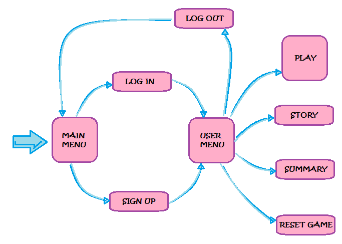

# EWW, virtual pet

## Introduction

An Eww is a creature that is born from a plant known as "the egg plant", which grows in India. These beings feed on insects, especially mosquitoes and need lots of water and love to live. When the living conditions are not good, Eww will be buried and will result in a new egg plant.<br/>
Thanks to this app, you can meet the Ewws and take care of them.


## Why did I decide to do this project?
Why did I decide to do a virtual pet?

When I knew that I had to choose a project, the first thing that I thought was that it should be something original and interesting for me. At first I thought about doing something related to children or education, but I didn't know exactly what. <br/>
One day, the idea of a virtual pet came into my head and I began to imagine how could it work, what its name might be, what it would look like... And the more I thought about it, the more I liked it. <br/>
Maybe it's not the most educative thing that I could do, but it's still original and besides I've enjoyed a lot developing this friendly pet and its "home".

## Functional description


The main page contains the main menu, where the user can access with his account or register.<br/>

Once logged in, one accesses the USER MENU, from where one can go directly to PLAY with ones pet, or see the Eww STORY on slides, or either check ones data and ones pet STORY in the SUMMARY or finally, do a RESET and start a new game, with a new Eww.<br/>
If it's the first time logged in or not have any live pet, a pop-up will ask for a name to create a new Eww.<br/>

The game screen consists on different sections that afford us to interact with our pet:<br/>
 * The pet's screen, where you can touch Eww to make him talk and pick up the poop he does.
 * The upper part, where the level bars are located that tell us what our pet needs.<br/>
 * The left menu, where there's the 'return to user menu' button and the 'music' button, which if we click it, plays music, of course. ;)<br/>
 * At the bottom, there's the 'interaction menu', which we will use for feeding our Eww, showering it and play with it.<br/>
 * And finally, on the right side, above, we have a space where what Eww says appears. And a little below, the name of the user and that of his pet is displayed.


### Functional diagram



## Pages & Components

### Pages

* Main
* Login
* SignUp
* Story
* Summary
* UserMenu
	* ModalName
* Play

### Components

* SimpleSlider
* Bar
* Foto
* GameScreen
	* Poohs
* Music
* ShowUserData
* Talking
* InteractionMenu
	* ToWetButton
	* ToFeedButton
	* ToPlayWithEwwButton
* ModalBuried


## Built With

* [ReactJS](https://reactjs.org/)
	* [React-redux](https://www.npmjs.com/package/react-redux)
	* [React-router](https://www.npmjs.com/package/react-router)
	* [Slick carousel](https://react-slick.neostack.com/)
	* [Bootstrap](https://react-bootstrap.github.io/)
	* [Styles-SASS]()
	* [Rodal modal](https://www.npmjs.com/package/rodal)
* [Firebase](https://firebase.google.com/)
	* Authentication
    * DataBase
    * Functions

## Data model structure

```
Users: {
	email: string,
    ewwId: string,
    lastName: string,
    name: string,
    uid: string
}

Ewws: {
	birth: Timestamp,
    cleanbar: number,
    foodbar: number,
    funbar: number,
    id: string,
    name: string,
    poohs: number,
    status: string,
    uid: string
}
````
